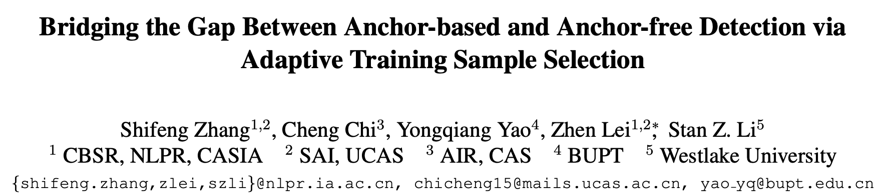
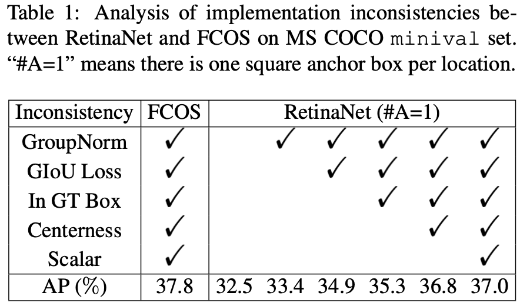
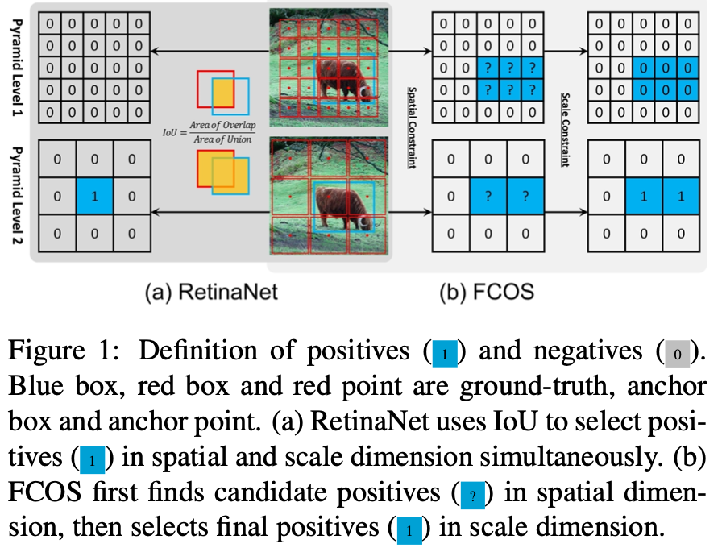
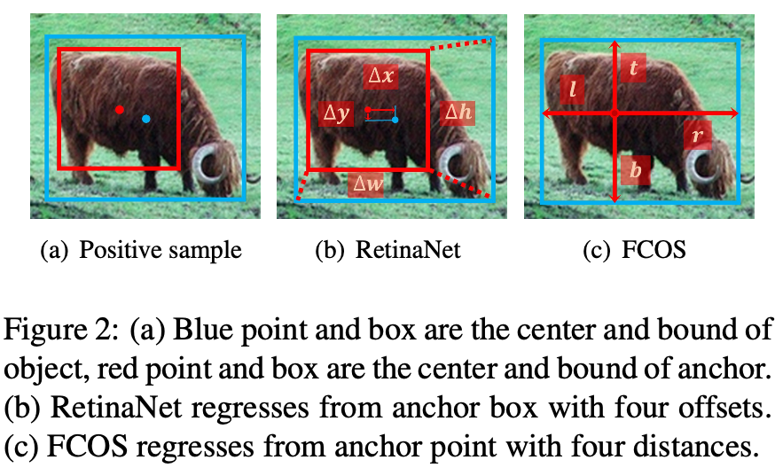
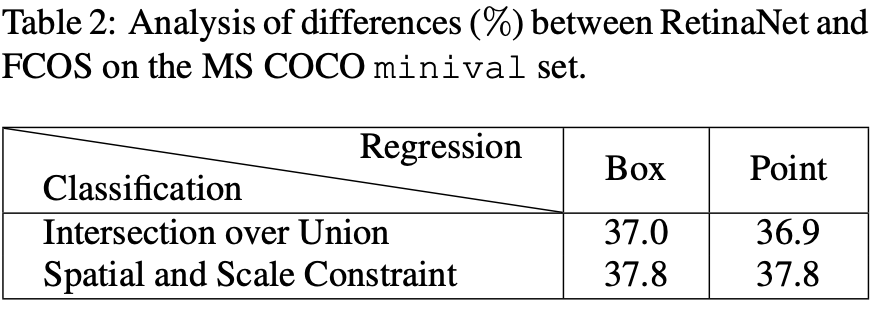
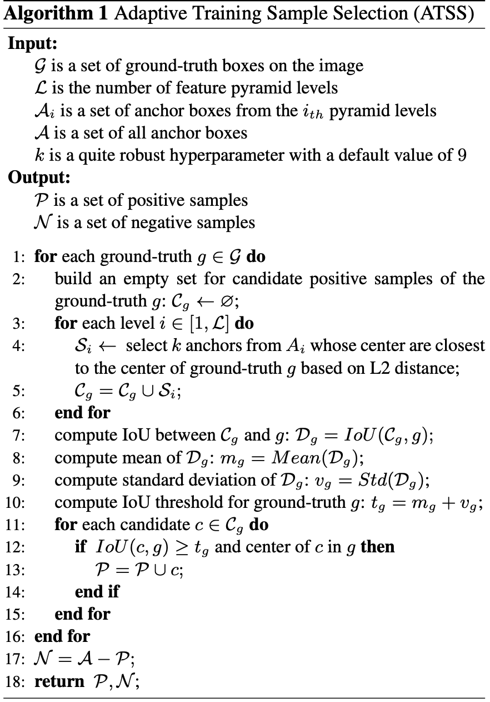
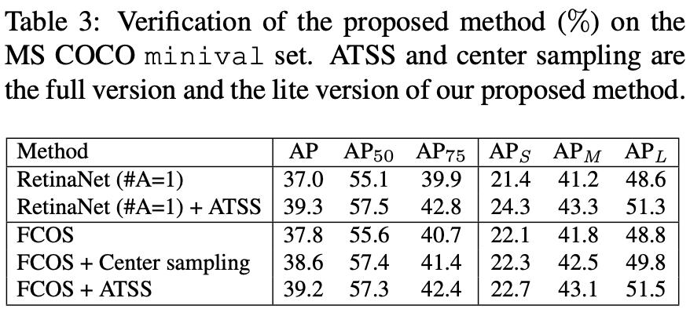

[TOC]

# ATSS：Adaptive Training Sample Selection

参考资料： [论文链接](https://arxiv.org/abs/1912.02424) [Github代码](https://github.com/sfzhang15/ATSS)

## Contribution

- anchor-based目标检测算法和anchor-free目标检测算法的**本质区别是如何定义训练使用的正负样本**
- 提出ATSS训练样本选择策略方法，无额外cost提高SOTA在COCO的指标
- 指出在每个gird使用多个anchor对检测是无用的操作

## 对比实验

为了分析AB和AF目标检测算法的差异，选择具有代表性的**RetinaNet**和**FCOS**进行对比

### 减少差异

将RetinaNet的anchor数改为$\#A=1$降低差异性，方便与FCOS比较，从表格中可以看出，在增加了GN；GIoULoss；center-point in GT bbox sampling；增加centerness分支；FPN的每层增加一个可学习的Scalar；FCOS仍比RetinaNet效果高了0.8%AP；

 

目前仍存在**两个差异**：

- 正负样本选择策略不同

  ​	a. $IoU$ 

  ​	b. 根据区域和尺度

   

- 回归方式不同

  ​	a. offset of anchor box

  ​	b. gird point distance to bbox $(l,r,t,b)$

   

### 分析差异

 

**分析结果：**

​	**从横向看：**

​		在采用同样的正负训练样本选择策略时，使用anchor box和使用anchor point的结果几乎**无差异**，说明回归方式不是对检测结果造成影响的因素

​	**从纵向看：**

​		在使用相同的回归方式时，正负样本定义使用根据空间位置和尺度的策略比基于IoU的策略好

因此可以得出**结论**：

​	**anchor-based目标检测算法和anchor-free目标检测算法的本质区别是如何定义训练使用的正负样本**

## ATSS的提出

 

### 主要步骤

- 根据anchor box与GT box中心点的**L2距离**，从FPN每层的Anchor中选取$k$个候选 $C_g$
- 计算所有 $C_g$ 与 $g$ 的 $IoU$ ，计算所有 $IoU$ 的均值 $m_g$ 和 标准差 $v_g$ 
- 得到$IoUthreshold$  $t_g=m_g+v_g$
- 从候选$C_g$ 中选择 $IoU>t_g$ 并且中心点在GT bbox $g$ 内部的为正样本，剩余anchor全部设为负样本

### 解释

- 根据L2距离选择候选，距离bbox中心点近的anchor能够产生高质量候选

  对于retinanet，IoU大的anchor中心点一般都离bbox中心点很近；对于FCOS，bbox中心点附近的anchor point产生的预测框质量高（center-ness分支的作用）

- 使用均值和标准差的**和**作为阈值

  **均值反应了预设anchor大小的适宜性**，均值越大说明预设的anchor大小与数据集中bbox的大小接近，正样本较多，因此需要更大的阈值剔除较差的候选。反之亦然，均值小说明设置的anchor大小与数据集bbox大小差距较大，因此需要较小的阈值获取更多正样本

  标准差反应了anchor对尺度变化的敏感程度，也就是哪个尺度适合检测这个目标。标准差大说明IoU的波动较大，也就是仅在某个尺度的较匹配。标准差小说明IoU的波动较小，也就是在多个尺度都匹配。

- 使用中心点在bbox范围内的anchor做正样本

  使用中心点在bbox外的anchor做预测会使用目标bbox外的feature做预测，造成混淆

- 使不同物体的正样本比例均衡

  对于RetinaNet和FCOS的原始策略，大目标的正样本比例比小目标比例大，造成不均衡

- 几乎没有超参数，对 $k$ 变化不敏感

### 效果

 

需要特别说明的是，由于FCOS是基于点的回归因此采用了两个方式进行了改进：

#### 简单实现

原始FCOS采用位于GT bbox内所有的anchor point作为正样本，这样会产生大量低质量的预测框，即使使用了center-ness进行了加权。**改进：**采用ATSS思路，选择每层距离GT bbox中心点最近的 top k=9 的anchor point 做预测，也就是center sampling

#### 复杂实现

将anchor point 改为长宽为 $8\times S$ 的anchor box根据ATSS策略选择正负样本，但是**仍使用anchor point去做 bbox 回归**。这种策略选择的anchor point 在空间上基本一致，但是在FPN的选择上不同。自适应的方法比固定*Scale的策略好。

## 后续的一些实验

后续的实验的一些结论：

retinanet中anchor数量对结果没影响，也就是主要还是正负样本的设定对结果造成影响

在fcos中，不同长宽比，不同大小对结果几乎没有影响

超参数 $k$ 在 [7，17]区间内几乎没有影响，过小正样本数量太少，过多低质量正样本数量过多

## 收获

单阶段目标检测中最大的问题就是正负样本极其不均衡，双阶段通过RPN先进行了筛选一定程度缓解了这个问题。后续有Focal Loss的提出也缓解了单阶段目标检测算法的这一问题。后续又提出了anchor-free的目标检测算法，提出效果比anchor-based算法好，并且泛化能力强，这篇论文主要就是分析效果的好的原因——在于训练时正负样本的定义。因此提出了一种自适应的正负样本选择策略ATSS，改善了SOTA性能。并且，指出在每个gird使用多个anchor没有作用。

启发：yolov5使用跨网格预测的方法同样是计算GT bbox中心点与每个gird的距离，选择最近的3个gird进行预测每个level又有3个尺寸的anchor，相比yolov4增加了正样本的数量，提高了1.7%的AP效果明显

是否可以采用ATSS策略改进yolov5？后续确定方案后可以进行实验。 // TODO

