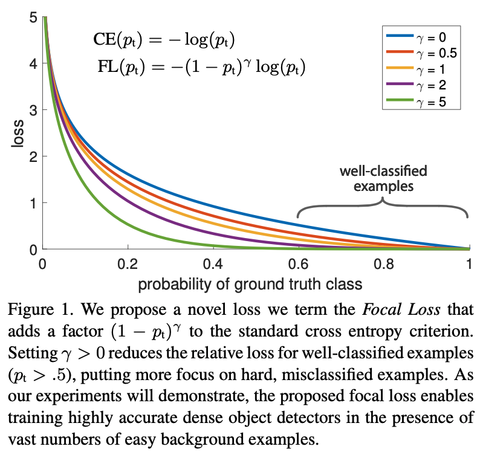

# Focal Loss for Dense Object Detection

## **Motivation**

研究单阶段稠密目标检测与双阶段RCNN系列的检测算法存在较大性能差异的原因：**正负样本极端不均衡**

## **方案**

Two-Stage算法：

1. 在第一阶段Proposal阶段通过SS、RPN等算法，将候选框降低至1-2k个
2. 在第二阶段通过随机抽选（RCNN：256个样本，128正，128负）等方法，固定了正负样本的比例

单阶段也可以采用这种方案，但是存在大量的**简单负样本**，导致训练效率很低，甚至模型退化。因此提出了FocalLoss，动态的平衡样本在损失中的权重，达到平衡样本的目的。

## **Focal Loss** 

**1.原始交叉熵损失**
$$
\mathrm{CE}(p, y)=\left\{\begin{array}{ll}-\log (p) & \text { if } y=1 \\ -\log (1-p) & \text { otherwise }\end{array}\right.
$$
公式可以简化为：
$$
\begin{array}{c}
p_{\mathrm{t}}=\left\{\begin{array}{ll}
p & \text { if } y=1 \\
1-p & \text { otherwise }
\end{array}\right. \\
\mathrm{CE}(p, y)=\operatorname{CE}\left(p_{\mathrm{t}}\right)=-\log \left(p_{\mathrm{t}}\right)
\end{array}
$$
很容易可以得出结论，虽然简单负样本的损失值很小，但是由于其数量庞大，仍然占据了损失值中的主导地位，主导了模型的学习方向。

**2.平衡的交叉熵损失**
$$
\mathrm{CE}\left(p_{\mathrm{t}}\right)=-\alpha_{\mathrm{t}} \log \left(p_{\mathrm{t}}\right)
$$
通过加入平衡权重 $\alpha_{t}$ 正例：$\alpha$ ，负例：$1-\alpha$

虽然加入权重可以提高正样本在loss中的比例，但是仍然没有区分简单和困难样本

**3.Focal Loss**
$$
\mathrm{FL}\left(p_{\mathrm{t}}\right)=-\left(1-p_{\mathrm{t}}\right)^{\gamma} \log \left(p_{\mathrm{t}}\right)
$$

通过改变权重因子的形式，改为 $-\left(1-p_{\mathrm{t}}\right)^{\gamma}$ ，使用分类的预测概率来控制权重，即：

1. 当GT=1也就是y=1的时候，如果分类错误，也就是p小于阈值，那么公式为： $\mathrm{FL}\left(p\right)=-\left(1-p\right)^{\gamma} \log \left(p\right)$

那么 $1-p$ 的值就会趋近于1，对loss的计算没有影响，当分类正确的时候，p趋近于1，这个样本对于模型来说比较”简单“，因此降低简单样本的权重；当GT=0的时候，y=0，如果分类错误，也就是p预测趋紧于1，那么公式为$\mathrm{FL}\left(p\right)=-\left(p\right)^{\gamma} \log \left(1-p\right)$，权重还是趋近于1，对计算没有影响，分类正确同理。

2. $\gamma$ 是超参数，$\gamma=2$ 结果最好

**最终的Focal Loss：**
$$
\mathrm{FL}\left(p_{\mathrm{t}}\right)=-\alpha_{\mathrm{t}}\left(1-p_{\mathrm{t}}\right)^{\gamma} \log \left(p_{\mathrm{t}}\right)
$$
