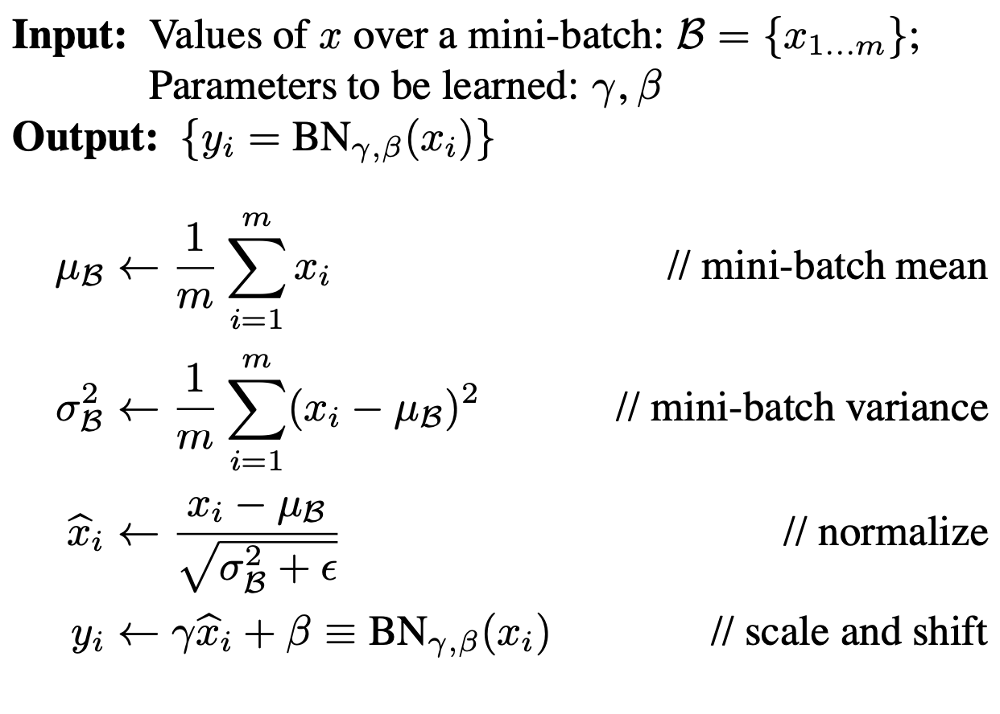

[TOC]

# 深度学习基础

## BN、LN、IN、GN

参考论文：

BN(2015): https://arxiv.org/pdf/1502.03167.pdf

LN(2016): https://arxiv.org/pdf/1607.06450v1.pdf

IN(2017): https://arxiv.org/pdf/1607.08022.pdf

GN(2018): https://arxiv.org/pdf/1803.08494.pdf

### Batch Normalization

#### Motivation

解决**内部协变量偏移**（Internal Covariate Shift）的问题：深度神经网络的层数较多，每一层的参数更新会导致上层的输入数据分布发生变化，通过层层叠加，高层的输入分布变化会非常剧烈，这就使得高层需要不断去重新适应底层的参数更新。为了训好模型，我们需要非常谨慎地去设定学习率、初始化权重、以及尽可能细致的参数更新策略。

网络一旦train起来，那么参数就要发生更新，除了输入层的数据外(因为输入层数据，我们已经人为的为每个样本归一化)，后面网络每一层的输入数据分布是一直在发生变化的，因为在训练的时候，前面层训练参数的更新将导致后面层输入数据分布的变化。以网络第二层为例：网络的第二层输入，是由第一层的参数和input计算得到的，而第一层的参数在整个训练过程中一直在变化，因此必然会引起后面每一层输入数据分布的改变。

#### 优势和缺陷

加快了模型的收敛速度(允许模型使用更大的学习率)，而且更重要的是在一定程度缓解了深层网络中“梯度弥散”的问题，从而使得训练深层网络模型更加容易和稳定。

**缺陷：**  1. 在batchsize过小时，效果非常差(测试结果表明：batch不能小于32) 2. 不能在RNN中使用(sequence的长度不一致，计算十分繁琐)

#### BN实现

 

## 