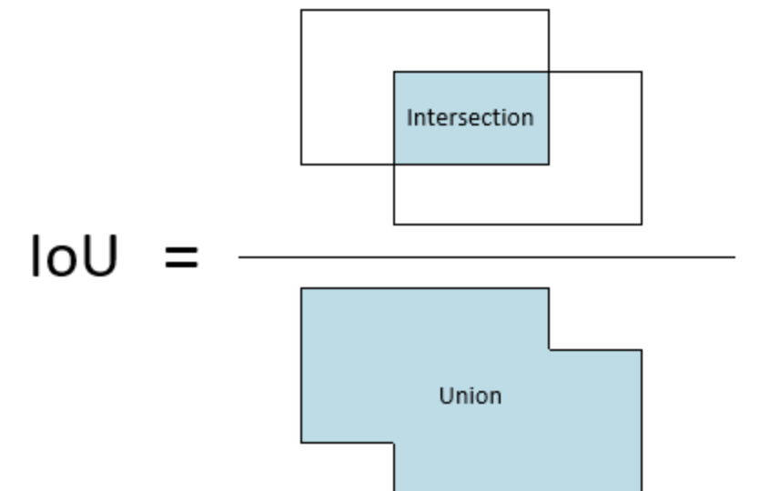

[TOC]

# 目标检测基础知识

## 前言

目标检测任务的主要目标是：**快速、精准、全面定位；准确分类**.

现阶段目标检测算法可以分为：**Anchor-based；Anchor-free；End-to-End**.

也可以根据检测检测步骤分为：**Two-stage和One-stage**.

**理解：**虽然目标检测算法有很多分类，但是实际上都是为了目标检测任务的目标做的一步步的改进。

Anchor-based算法是目前检测算法的主流。是早期对网络学习能力较差的妥协。但是使用Anchor的目标检测算法，在生成预测框的时候产生了大量的冗余框，需要大量的IoU计算，增加了计算量。并且，anchor是超参数，需要对不同数据集进行统计获得，普适性较差。因此，为了解决这个问题近年提出了一些Anchor-free的目标检测算法。

## 评价指标

### mAP计算

假设数据集中有2类，n个数据。那么标签可以简单认为是0，1，则有x个0，n-x个1

对于类别C=0，检测出了k个数据，则 $TP=$确实是0的数据，$FP=$不是0的检测结果，TN代表是1且未被检测出的结果，FN代表是0，但是未被检测出；

那么，查准率 **Precision**：
$$
P = \frac{TP}{TP+FP}
$$
召回率**Recall**：
$$
Recall = \frac {TP}{TP+FN}
$$
然后根据不同的recall值绘制P-R曲线，类别C的AP就是P-R曲线与坐标轴的面积；**mAP就是所有AP的平均**

AP：coco在[0,1]之间均匀采样101个点计算P然后求平均得到AP

coco：在IoU阈值在0.5-0.95之间每隔0.05计算一次AP再取平均得到该类别最终的AP

**思考**

mAP在实际应用中的意义，看了很多资料，都在说mAP在工业界的使用并不多，一般都会限定Precision下看Recall或者限定Recall下看Precision

### IoU及IoU loss和改进(GIoU、DIoU、CIoU)

bbox坐标定义

coco：$[x_{min},y_{min},x_{max},y_{max}]$

Yolo： $[x_{center},y_{center},w,h]$

转化：

```python
# coco2yolo
def coco_to_yolo(box):
    """ convert coco to yolo
        coco_box = [xmin, ymin, xmax, ymax]
        yolo_box = [xcenter, ycenter, w, h]
        xmin, ymin, xmax, ymax = b[0], b[1], b[2], b[3]
        center = (min + max) / 2.0
        length = max - min
    """
    return [(box[0] + box[2]) / 2.0, (box[1] + box[3]) / 2.0, box[2] - box[0], box[3] - box[1]]


# yolo2coco
def yolo_to_coco(box):
    """ convert yolo to coco
        yolo_box = [xcenter, ycenter, w, h]
        coco_box = [xmin, ymin, xmax, ymax]
        xcenter, ycenter, w, h = b[0], b[1], b[2], b[3]
        min = center - length / 2.0, max = center + length / 2.0
    """
    return [box[0] - (box[2] / 2.0), box[1] - (box[3] / 2.0), box[0] + (box[2] / 2.0), box[1] + (box[3] / 2.0)]
```

#### IoU​的计算

  

公式拆解为：
$$
IoU=\frac{inter}{Union}= \frac{S_1}{B_1+B_2-S_1}
$$
对$S_1$坐标的求解可以分解为对 X 轴和 Y 轴两个 bbox 坐标交集的求解

```python
xmin = max(xmin1, xmin2)
ymin = max(ymin1, ymin2)
xmax = min(xmax1, xmax2)
ymax = min(ymax1, ymax2)
#如果不相交，则会出现下列某种情况
xmax < xmin or ymax < ymin
```

因此$IoU$的计算方法为：

```python
def iou(box1, box2):
    # coco type box=[xmin, ymin, xmax, ymax] or [l, t, r, b]
    w = min(box1[2], box2[2]) - max(box1[0], box2[0])
    h = min(box1[3], box2[3]) - max(box1[1], box2[1])
    inter = 0 if w < 0 or h < 0 else w * h
    union = (box1[2] - box1[0]) * (box1[3] - box1[1]) + (box2[2] - box2[0]) * (box2[3] - box2[1]) - inter + 1e-6
    return inter / union
```

#### IoU loss

使用MSE作为坐标的回归损失，是先对四个坐标点单独计算然后求和，并没有考虑到4个坐标的相关性，可能会出现loss相等，但是IoU不同的情况，造成混淆。因此提出了IoU loss，原论文公式为：$\mathcal{L}=-\ln (I o U)$ ，但一般在实际的使用中使用下列公式：
$$
\mathcal{L}_{IoU} = 1 - IoU
$$
**缺陷：**

1.如果两个框没有相交，根据定义，IoU=0，不能反映两者的距离大小（重合度）。同时因为loss=0，没有梯度回传，无法进行学习训练。

2.IoU无法精确的反映两者的重合度大小。也就是IoU相等的时候，重合度较差

#### 改进1: GIoU loss

$$
\mathcal{L}_{GIoU} = 1 - GIoU = 1-IoU+\frac{|Cover-Union|}{|Cover|}
$$

为了解决当 $g_t$ 与precision不相交无法重合的问题，增加了一个最小闭包区域（最小外接矩形）Cover与Union的差集与Cover的比值作为惩罚项。

#1 不相交，Union=0，惩罚项=1

#2 相交，重合度低，则差集与Cover的比值较大，重合度高则较小。完全重合，惩罚项=0

**缺陷：**

如果presion出现在$g_t$**内部**的不同位置，此时GIoU的惩罚项为0，无法区分相对位置；

从惩罚的原理来分析，GIoU会促使模型先增大predict的大小，使其与$g_t$重合，这样在一定程度上会影响收敛速度（感觉好像也就那样）

#### 改进2: DIoU loss

$$
\mathcal{L}_{D I o U}=1-I o U+\frac{\rho^{2}\left(\mathbf{b}, \mathbf{b}^{g t}\right)}{c^{2}}
$$

延续GIoU的思想，使用最小外接矩形；由于GIoU无法区分相对位置，因此使用gt和predict的中心点欧式距离平方除以最小外接矩形的对角线平方作为惩罚项。直接优化p和gt的距离。

**缺陷：**无法衡量pre的长宽比(实验表明在**识别小目标**时DIoU效果最好)

在NMS过程中，可直接替换IoU，效果较好；（原理：当两个框的中心距离较大时，不是重复检测）

#### 改进3:CIoU loss

增加一个长宽比相似度的惩罚项，$\alpha v$ 

#### 思考：

从IoU到CIoU，每个改进都是针对上一个缺点的改进，但是应该衡量每个惩罚项的权重？比如结果表明，FasterRCNN在AP-s指标，使用DIoU loss效果较好。相比IoU，GIoU和CIoU反而掉点，虽然总的AP提高了。

### NMS及其变体

#### NMS

Step1: 将pred按照类别划分

Step2: 按照scores进行从大到小排序

Step3: 将最大的加入keep，计算其与剩下所有框的IoU，剔除大于阈值的bbox

Step4: 重复Step3

Step5:每个类别都进行

**缺陷**

剔除大于阈值的bbox等价为将其score设置为0，这样在密集检测时，剔除了正确的检测框。

#### Soft-NMS

原始nms很hard导致可能剔除了正确的检测框。因此在当IoU大于阈值的时候不设置为0，而是加了一个权重（1-IoU），原始的权重可以理解为（0，1）

#### DIoU-NMS

将IoU计算改为DIoU，考虑两个检测框的中心点距离，距离远，IoU超过阈值的说明不是重复检测。

## 什么是Anchor？

Anchor是在图像上预设好的不同大小，不同长宽比的参照框。Faster RCNN中的RPN使用三个尺度{128，256，512}，三个比例 {1:1, 1:2, 2:1}，共9组anchor。在YOLO中，自v2开始使用anchor。yolo中的anchor是通过k-means算法在数据集中统计得到的，v2中k=5，v3中k=9.