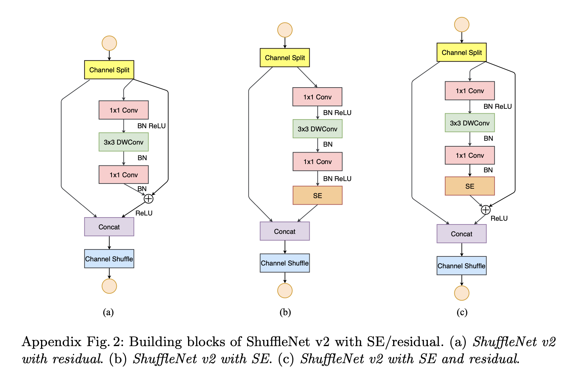
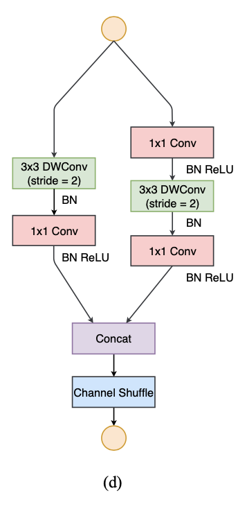

[TOC]

# 轻量模型

## ShuffleNetV2

### 轻量模型设计原则

1.深度可分离卷积：**同等通道大小最小化内存访问量**
$$
MAC=hw(c_1+c_2)+c_1c_2\\
B = hwc_1c_2\\
M A C \geq 2 \sqrt{h w B}+\frac{B}{h w}
$$
所以当 $c_1=c_2$时**MAC**最小

2.分组卷积：**过量使用组卷积会增加MAC**
$$
\begin{aligned}
\mathrm{MAC} &=h w\left(c_{1}+c_{2}\right)+\frac{c_{1} c_{2}}{g} \\
&=h w c_{1}+\frac{B g}{c_{1}}+\frac{B}{h w}
\end{aligned}
$$
可以看出MAC与g正相关，g越大，MAC越大，因此**需要仔细衡量分组数量**

3.多分枝网络：**网络碎片化会降低并行度**

一些网络如Inception，以及Auto ML自动产生的网络NASNET-A，它们倾向于采用“多路”结构，即存在一个lock中很多不同的小卷积或者pooling，这很容易造成网络碎片化，减低模型的并行度，相应速度会慢，这也可以通过实验得到证明。

4.**减少元素级操作：add，ReLU等等**

对于元素级（element-wise operators）比如ReLU和Add，虽然它们的FLOPs较小，但是却需要较大的MAC。这里实验发现如果将ResNet中残差单元中的ReLU和shortcut移除的话，速度有20%的提升。

### 网络结构设计

**分析：**

可以看出与shufflenetV1不同，去除了1X1的分组卷积（rule 2），输出输入通道数一致（rule 1），采用Split操作降低通道数，分支合并使用concat（rule4），然后使用shuffle进行信息交流，并且可以和下一个stage的channel split融合为一个元素级操作（rule 4）

对于下采样模块（图D），不再有channel split，而是每个分支都是直接copy一份输入，每个分支都有stride=2的下采样，最后concat在一起后，特征图空间大小减半，但是通道数翻倍。